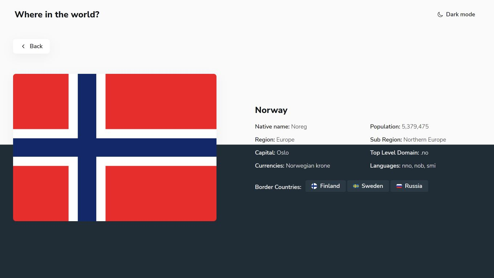

# Where in the World

Encyclopedia of the world's countries.

## Table of Contents

- [Overview](#overview)
- [Technologies](#technologies)
- [Usage](#usage)
- [Live Demo](#live-demo)
- [Project Status](#project-status)
- [Contributions](#contributions)
- [Author](#author)
- [Acknowledgements](#acknowledgements)

## Overview

Where in the world provides information of 250 countries, using REST Countries API.
This frontend project is based on the challenge by [Frontend Mentor](https://www.frontendmentor.io/challenges/rest-countries-api-with-color-theme-switcher-5cacc469fec04111f7b848ca) with a little redesign and additional features, like **sort by popularity** and **skeleton screen**.

## Technologies

- [SASS](https://sass-lang.com/)
- Javascript
- [REST Countries API](https://restcountries.com/)

## Usage

1. Clone this repository
2. Open `index.html` in your browser
3. Enjoy learning about the world's countries

## Live demo

You can view a live demo of this project [here](https://hesam-fattahi.github.io/where-in-the-world/).

## Project Status

This project is currently in development. The **React version** of the project is currently in progress. Future updates may include additional features and improvements.

## Contributions

**Contributions are welcome and greatly appreciated!** Please open an issue or submit a pull request if you would like to contribute.

- [Report bug](https://github.com/hesam-fattahi/where-in-the-world/issues)
- [Request feature](https://github.com/hesam-fattahi/where-in-the-world/issues)

## Author

- Github - [hesam-fattahi](https://github.com/hesam-fattahi)

## Acknowledgements

- [Frontend Mentor](https://www.frontendmentor.io/)
- [REST Countries](https://restcountries.com/)
- [Ion Icons](https://ionic.io/ionicons)
